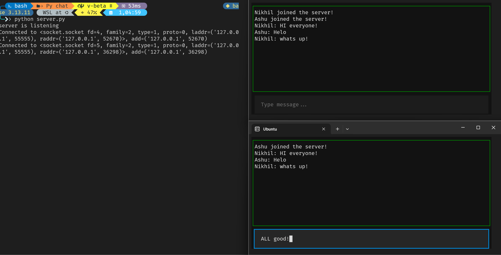

<div align="center">


# PyChat — Terminal Chat Application

**A real-time multi-client chat system with a modern terminal UI using Textual**

<br/>

[](https://www.python.org/)
[](https://textual.textualize.io/)
[]()
[]()
[]()

<br/>

</div>

---

## Overview

PyChat is a terminal-based real-time chat application that allows multiple users to communicate over a network.
It combines low-level socket programming with a structured terminal UI to deliver an interactive chat experience.

---

## Screenshot

<div align="center">



</div>

> PyChat: Live Multi-User Terminal Chat

---

## Features

* Real-time messaging using TCP sockets
* Multi-client support with threading
* Nickname-based user identification
* Terminal UI with fixed input and scrollable chat
* Message alignment (self vs others)
* Styled message rendering
* Auto-scrolling chat window

---

## Architecture

```text
Textual UI (Frontend)
        ↓
Socket Client
        ↓
Socket Server
        ↓
Multiple Clients
```

---

## Project Structure

```text
pychat/
│
├── server.py
├── client.py
├── assets/
│   └── screenshot.png
├── .gitignore
├── README.md
```

---

## Installation

### Clone repository

```bash
git clone https://github.com/your-username/pychat.git
cd pychat
```

### Install dependencies

```bash
pip install textual rich
```

---

## Usage

### Start server

```bash
python server.py
```

### Start client (multiple terminals)

```bash
python client.py
```

Enter your nickname and begin chatting.

---

## Network Configuration

* Default: `127.0.0.1` (local)
* For external access:

  * Change server host to `0.0.0.0`
  * Use public IP in client

---

## Technologies

* Python
* Socket Programming
* Threading
* Textual
* Rich

---

## Limitations

* No persistent storage
* No authentication

---

## Future Improvements

* Authentication system
* Database integration
* Public deployment
* Typing indicators
* Multi-room chat

---

## Author

Nikhil Kumar Baranwal

---

## License

MIT License

---
